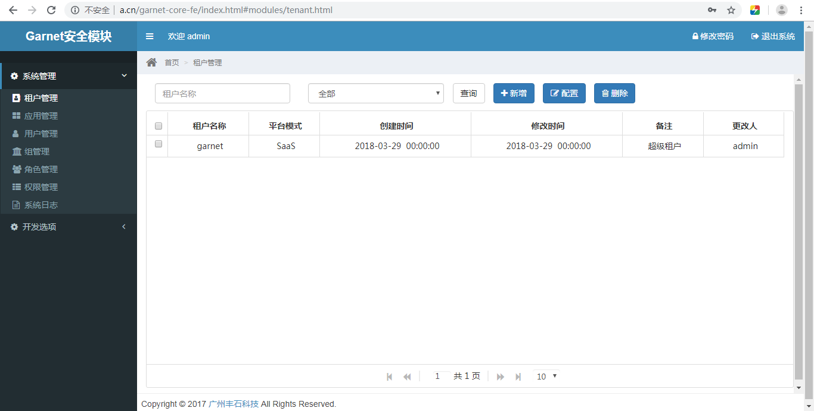

# 分支说明：
> 1. 本分支来自 garnet-core-be-fe v2.1.0 develop 分支；
> 2. 本分支分离了后端代码，只保留前端代码。
> 
> by Jaffray, 2019/06/07 1:26AM

---

**项目说明** 

#### 1. 配置

打开 “js/config.js”：
```js
var domain = "http://localhost:12306";
var apiPath = "/garnet/api/v1.0/";
var baseURL = domain + apiPath; // http://localhost:12306/garnet/api/v1.0/
```

#### 2. 部署运行

按上述方式配置好以后，在任意 Web 服务器上皆可运行，效果如下图：

